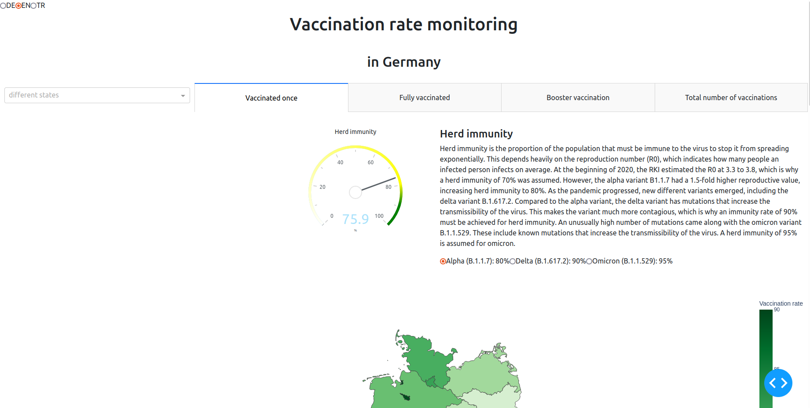

# Robert Koch Institut - Impfquotenmonitoring
## by Leylanur Bodur, Melanie Vogel, Johanna von Wachsmann (Group 6)

The data visualization of this project was developed as part of the Data Visualization module at Freie Universität Berlin.

### Context
In light of the current pandemic situation due to COVID-19, the Robert Koch Institut (RKI) and the Bundesministerium für Gesundheit (BMG) publish data frequently regarding the development of the pandemic: e.g. the current incidence numbers and data about the vaccination progress in Germany. Additionally, a data set about the vaccination progress per state in Germany was included, which shows how the progress differs between the states. Furthermore, there is data about the vaccines themselves, the vaccination deliveries, the age groups, facilities, hospitalization and both the numbers of vaccinations and the vaccination rates.

So, what is a vaccination rate ("Impfquote")?

The vaccination rate is the proportion of all people in the total population that got vaccinated so far. Since there is no standardized system for the elicitation of vaccination data in Germany, subsamples and representative samples are used in order to allow an assessment of the current vaccination situation. The RKI and BMG officially publish the most updated  and best collection of the vaccination data.

### Concept
We orientate ourselves by existing visualizations and descriptions of the RKI on the [RKI website](https://www.rki.de/DE/Home/homepage_node.html;jsessionid=2364739DC6D041785EB5E9E5C8DFB1DC.internet092) and on the [Impfdashboard](https://impfdashboard.de/daten). We use a choropleth map as our map layout, to show a good overview of the data in Germany. The number of vaccinations is color-coded. The initial color scheme was too colorful (and confusing) and not suitable for colorblind people.

The map shows the state borders in Germany and the numbers also represent state level. This has several reasons. To begin with, our goal is to give a general, really intuitive and non-confusing overview of the situation, whereas neighborhood level would yield a lot more numbers, borders and colors. This might be very confusing and overwhelming, especially for older people, and is not suitable for our approach, since we also provide a mouse hover feature vor detailed numbers per area. Secondly, direct comparisons of the number of vaccinations between a neighborhood in a metropole region and a country region would not be suitable.  Thirdly, the available data from the RKI and the BMG is also divided in states and data for all neighborhoods in Germany is hard / impossible to get our hands on for all figures and comparisons we want to provide.

Furthermore, we decided to provide different language settings. The user should be able to choose between German, English, Turkish and Russian. This selection is based on the one on the website of the Impfdashboard, as well as on the fact from a [press handout from destatis](https://www.destatis.de/DE/Presse/Pressemitteilungen/2018/09/PD18_329_122.html), that besides English, these are the three most frequently spoken languages in Germany.

In general, we want to provide a map of Germany, where the user can hover over the different states to see the specific vaccination numbers and rates. There should be a drop down menu to select a specific state. If time permits, the map should be interactive in a way, where the user can also click on the respective state instead of choosing it from the drop down menu. There should be four different tabs the user can click on. One to display the vaccination rates of at least once vaccinated people, one to display fully vaccinated people, one for booster vaccination rates and the last one for the vaccination numbers instead of rate. We would also like to include a kind of tachometer that shows the current vaccination progress w.r.t. herd immunity and how much is missing per virus variant. Below the map, there should be more detailed information about the pandemic, general information, the vaccination progress and the vaccines. Next to it, there should be an overview of the vaccination progress over time in Germany. Below, there should be an overview of the vaccination rate per age group in Germany. The latter should change accordingly to a state when chosen, so that the vaccination rate per age group in the respective state is shown. Similar to that, we also want to show the hospitalization status in Germany.

What is the purpose of our visualization?

We want to give a good and easy to understand one glimpse overview of the current situation in Germany regarding the pandemic, with information on the vaccination progress per age group and state, as well as the current burden on hospitals through the hospitalization cases itemized by age group and vaccination status. This will especially help executives in the healthcare sector to make informed decisions and to give advice accordingly. We want to emphasize the importance and idea of herd immunity and how close we are to that goal. We also want to display more visualizations in one place (at one glimpse) in comparison to existing websites. With the hospitalization graph we hope to visualize the importance of vaccinations and how hte cases are usually less severe when people are vaccinated.

### Prototype -has to be updated to Screencast!!!
The following two pictures portray the prototype. It is possible to hover over a state with the cursor to see the number of vaccinations in that state. The map is color-coded by the number of vaccinations according to the scale on the right side. On the left side is a drop down menu, where one can choose a state, which is then shown instead of the whole of Germany ([Auswahl Berlin]). There are also radio buttons for the selection of the language.

#### Domain problem characterization
The provided data set is a collection and overview of vaccination numbers in Germany. COVID-19 is a contagious disease caused by Sars-Cov-2, which currently causes a worldwide pandemic. The first known case was identified in Wuhan, China. The vaccinations in Germany have been approved since the end 2020, to protect people. An attempt is made to immunize the entire population by vaccinating a certain proportion of the population (herd immunity). The needed proportion for herd immunity is growing, due to the emergence of new virus variants. The problem we see in existing visualizations of the vaccination numbers is the lack of a good and especially easy to understand overview with all the information in one look. Questions like the current distribution of vaccinations per state and age group regarding risk assessment may arise, as well as the current hospitalization rate and hence, the burden on hospitals.
Our target group is mainly managers in the healthcare sector. One task of many executives is the monitoring of the pandemic development in order to make informed decisions and give advice respectively, so that the spread of COVID-19 is further limited. Our visualizations and dashboard give an overview of the current pandemic situation in Germany. Since vaccinations are widely discussed right now and have a great influence on political decisions, this is also our focus on the dashboard, where we want to provide the vaccination rates and number also per state in Germany, as well as an overview of the progress regarding the herd immunity per virus variant. The vaccination progress over time in Germany should be depicted and an overview per age group and state. One concern is also the hospitalization, which is why we also present the hospitalized COVID-19 cases itemized by age group and vaccination status. The incidence value for hospitalized people according to their vaccination status could give incentive to people to get vaccinated and portray the importance of vaccines especially in older people.

#### Data / task abstraction: Formulate the tasks in a domain-independent vocabulary. Do not forget to describe your data sources based on the data Nutrition label information. How did you prepare (aggregate, filter...) the data to support the tasks? What tasks do you support?

### Data

We were provided with the data sets created by and from the Robert Koch Institut (RKI). Additionally, we got the hint to also use the data sets from the impfdashboard, where the data sets are created together by the RKI and the Bundesministerium für Gesundheit (BMG).

From the RKI we use the [data set](https://www.rki.de/DE/Content/InfAZ/N/Neuartiges_Coronavirus/Daten/Impfquotenmonitoring.html) on reported vaccination per state and the vaccination rates per age group. This data set gets updated during business days and the code always loads the newest version and provides the data version, which we extract from the first excel table of the file and display on our dashboard. The data set is provided as Microsoft Excel file (.xlsx). The data from vaccination centers, mobile teams, hospitals and local health authorities from the states are transmitted daily as pseudonymized data and are available since 27th december 2020. From panel doctors the data gets transmitted daily in two separate data packages: One for the number of realized vaccinations per doctor's office itemized by vaccine and vaccination dosis since 10th march 2021, and second itemized by age group <18, 18-59 and 60+ years and vaccination dosis since 26th march 2021. Since 14th december 2021 data itemized by age group <18 years, 6-11 years, and 12-17 years gets transmitted as well. From company doctors the pseudonymized data gets transmitted since 7th june 2021. The cumulative number of vaccinations includes all vaccinations which were given up to and including the day before we load the data from the website. The data gets transmitted until the next day at eight o'clock in the morning to the RKI. Late registrations and data corrections from past days are also included in the cumulative number. The regional assignment of all given vaccinations occurs based on the location the vaccination takes place and not based on the address of the vaccinated person. Only the location of where the vaccination took place is included in the data sources. Since these regional vaccination data for the calculation of the vaccination rate are oriented on the respective residential population,  it can happen arithmetically that rates of <100% are calculated. For the vaccination rates of the at least once vaccinated adults (age group 18+ total), all Janssen vaccinations of the panel doctors are summarized under the assumption, that for this vaccine, according to the admission, only people of 18 years and older were vaccinated. Another itemization into the age groups 18-59 years and 60+ years is not possible, since the vaccination rates of the at least once vaccinated people is accounted too low systematically, since the Janssen vaccinations of the panel doctors are not included here. In the aggregated data of the panel doctors, the Janssen vaccinations are always transmitted as second vaccinations, an assignment of the vaccinations to age groups is missing.
 
For the hospitalization figure, we also use a [data set](https://www.rki.de/DE/Content/InfAZ/N/Neuartiges_Coronavirus/Daten/Inzidenz_Impfstatus.html) from the RKI website, where the data gets updated once per week. The code pulls the latest version available online and prints the date of the pulled version onto the dashboard. For the calculation of the vaccination rate, the population status from the 31st december, 2020 was used. The same goes for the aforementioned data set, where it is stated that the population status is collected from the [Statistisches Bundesamt (Destatis)](https://www.destatis.de/DE/Themen/Gesellschaft-Umwelt/Bevoelkerung/Bevoelkerungsstand/Tabellen/bevoelkerung-nichtdeutsch-laender.html). The information on the total number of fully vaccinated and unvaccinated people is retrieved from the digital [vaccination rate monitoring of the RKI](http://www.rki.de/covid-19-impfquoten), which is the data set described above and for which the population status source also applies. Additionally, for both data sets, initially immunized people got a second vaccination or one vaccination with the Janssen vaccine at least 14 days ago. People with booster vaccination must have received it at least seven days ago and the number of unvaccinated people was calculated from the difference between the population number and the number of people with at least one vaccination.
The data set is described as follows: For the depiction of the effect on the vaccinations on the COVID-19 disease burden throughout the population, the incidence of symptomatic as well as hospitalized COVID-19 cases of fully vaccinated and unvaccinated people was calculated separately and uploaded weekly since calendar week 28 of 2021. COVID-19 cases are regarded as initially immunized (fully vaccinated), when the transmitted data show two vaccination doses of a COVID-19 vaccine (Comirnaty - BioNTech/Pfizer, Spikevax - Moderna, Vaxzevria - AstraZeneca, or a combination of two of them) or one dose of the Janssen vaccine (Johnson & Johnson) and the date of the last vaccination was at least 14 days before the start of the disease, or at least three doses of a COVID-19 vaccine or two doses of the Janssen vaccine are listed, where the date of the last vaccination was at maximum six days before the begin of the disease. Cases are regarded as cases with booster vaccination, when the transmitted data shows three doses of a COVID-19 vaccine or at least two doses of a Janssen vaccine and the date of the last vaccination was at least seven days before the begin of the disease. When the data showed that cases were at least fully vaccinated and the date from the last vaccination was before the 1st June 2021, these cases were viewed as initially immunized, since a booster vaccination is highly unlikely before that date, and incorrect information was more likely provided. Cases are regarded as unvaccinated if they were transmitted as unvaccinated. Cases which cannot be assigned to either of the categories above are excluded from the analysis. This can happen if the information on the vaccination status is incomplete or an incomplete vaccination was stated.

From the impfdashboard we used the [data set](https://impfdashboard.de/daten) with the timeseries of the vaccination progress in Germany. The data set gets updated daily during business days and is provided in the form of a tsv file. The data version and date are provided as metadata on the website and we display the date on our dashboard accordingly. The data creation range starts on the 27th December 2020 and still continues.

### Task abstraction
Data Preparation: For the Germany choropleth map geo data was needed which was downloaded in the form of a geojson file. The geo data was also used for the vaccination progress by state, where it was necessary to decode the given IDs from the data set to match the geo data. For the vaccination rate per state and age group the geo data id was also used. From the chosen data set the correct sheet needed to be selected and the needed columns were extracted and renamed. For the hospitalization data set the correct data sheet needed to be selected and a data frame with the selected columns was created to create the plot. The columns were reported calendar week and year and vaccination status by age group. For the time series of vaccination progress in Germany a dataframe with selected columns was created per dose (cumulative). 
Tasks: The visualizations are supposed to infirm the target group about the state of the pandemic and visualize the data in manageable plots. The dashboard provides a lot of information about the vaccine all in one place. Additionally, we hope to raise awareness of the importance of herd immunity and corresponding vaccination rates and vaccination incidence.

#### Visual encoding / interaction design: Describe the visual encoding and why you decided for it. What interaction types did you use and why? (be precise and try to cover all details in this part)

### Visual encoding
The first plot is a choropleth map of Germany. We used the green color gradient to symbolize the higher the vaccination rate the better, because green is usually associated with positive numbers. The tachometer for the herd immunity is also color coded in yellow for below herd immunity and green reached herd immunity. We decided on a white background to make the entire page brighter and not have huge contrasts between plots and backgrounds where the focus might get lost. Additionally, most informative websites tend to have white backgrounds and since we liked the general design we decided upon it. 
The figures are not too bright and colorful since the topic is serious and too many colors would distract the user. The colors are customized to suit people with colorblindness. Expressive plots include the map visualizing the highest and also lowest vaccination rates and total numbers of vaccinations, the continuous progress of the vaccination time series and the hospitalization incidence of especially 60+ year olds.
The chosen plots were line and bar charts with lines not too thin or thick – they are easily visible but do not blur together. The line chart was chosen to visualize a timer series event. Line charts seem very appropriate to visualize change over time. The bar chart encodes two attributes using vertical space positions for a numerical value and horizontal space position for categories; this leads to a better comparison between groups. The vertical bars were chosen because it is more difficult to compare horizontal bars vertically than to compare horizontal bars horizontally. The choropleth map was chosen to compare the total surfaces (of the states) with each other.

### Interaction design
The interaction types implemented in the project are data and view specifications like filtering data for focus: the dropdown state filter and figure category selection. View manipulation is implemented for selection – the highlighting and filtering via a drop down menu, figure legend and radio buttons and organization – selecting between the different tabs.
The implemented interaction includes hovering to receive more information, dropdown menus and radio buttons to select and filter, figure legend for selection and tabs for organizational purposes.

### Reflection
#### What did not work as expected (and why?)
As stated above, we wanted to include three languages besides German. Since we don't have a native Russian speaker in our group and we didn't want to display incorrect information, we decided to leave out the Russian language in the end.
We created a figure with the incidence numbers versus the vaccination rate, as described in the beginning, but quickly saw that this graph might be misleading, creating a false correlation between both data. The final feedback round confirmed this for us and we deleted the figure with the knowledge that our dashboard is fine as it is.
We wanted to have the functionality not only to be able to select the states via drop down menu, but also by clicking on them on the map, but this didn't work out.
Furthermore, we thought of adding pictograms of a vaccination symbol, hand washing, keeping distance, and so on, but this didn't work out as well.

#### What would you improve if you had more time?
We would like to integrate the aforementioned points, especially the functionality of clicking on the states. Additionally, with more time it would have been possible for us to round the visual aspect of the dashboard and fix minor aesthetics i.e. spacing between buttons, rounding the numbers in the plots and balanced spacing and placement of graphs/items on the dashboard.

#### If you used other libraries or frameworks other than Altair please explain briefly why.
For this project we used dash, which is a good and easy to use library for creating a dashboard with plotly figures. All group members have more expertise and are more familiar with plotly, so that was the obvious choice.
